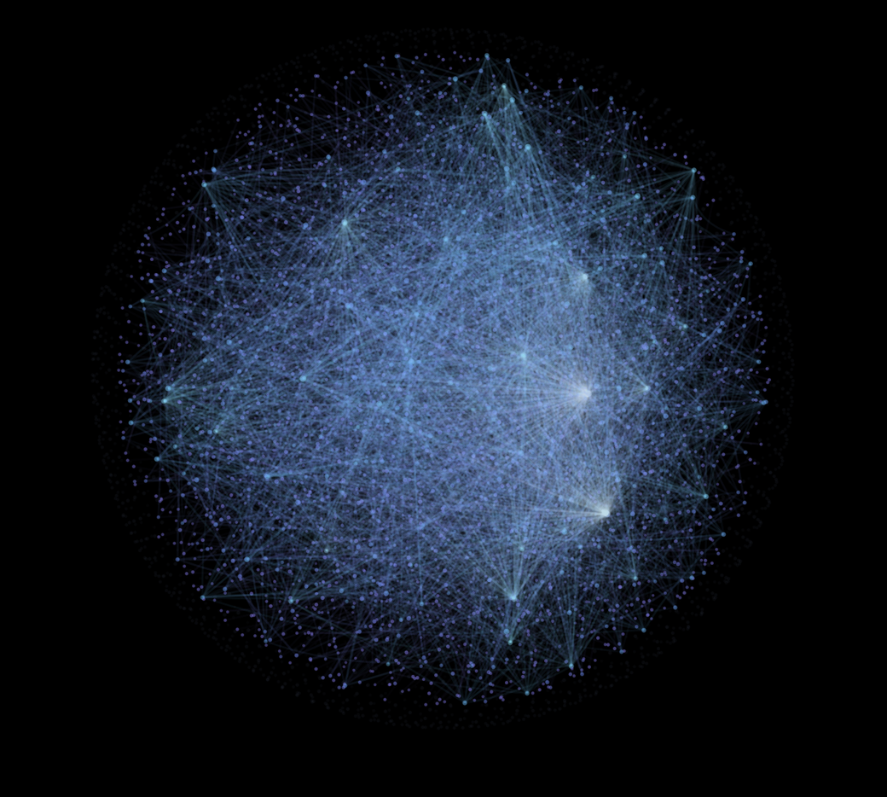

# Context Layer

[](https://github.com/solisolsoli/context-layer/actions/workflows/tests.yml)

**Give your AI agents the context in your notes.**

Context Layer connects a folder of Markdown notes or an Obsidian vault to your
AI tools. Ask why a decision was made, pick up a project, or look up a setup
guide: it retrieves the original passages and their sources so an agent can
work from your material.

- **Keep your notes where they are.** Search runs locally; Obsidian is optional.
- **Follow the connections you wrote.** Link-aware search can bring in related
  notes when the answer spans more than one file.
- **Check where an answer came from.** Passages include file paths and hashes;
  changed sources are withheld until the index is refreshed.

[Quick start](#quick-start) · [Connect an agent](#connect-an-agent) ·
[GitHub context](#fill-a-gap-from-github) · [Documentation](docs/README.md)

<p align="center">
  
</p>
<p align="center"><sub>The optional Obsidian Brain View. Run a search to highlight the notes and links it used.</sub></p>

## Quick start

You need **Git and Python 3.10+ with SQLite FTS5**. The core uses only Python's
standard library; the local demo needs no AI account, API key or Obsidian install.
The commands below create a new folder of fictional example notes.

First, get the repository:

```sh
git clone https://github.com/solisolsoli/context-layer.git
cd context-layer
```

On **macOS or Linux**, install and try a question:

```sh
python3 -m venv .venv
. .venv/bin/activate
python -m pip install -e .

context-layer brain init ~/ContextLayerDemo --apply
context-layer index ~/ContextLayerDemo
context-layer search ~/ContextLayerDemo --prompt "which timer controller did we choose and why" --method synaptic
```

<details>
<summary><strong>Windows PowerShell</strong></summary>

After the same clone and `cd` steps, use these commands. No activation script
is needed:

```powershell
py -m venv .venv
.\.venv\Scripts\python.exe -m pip install -e .

.\.venv\Scripts\context-layer.exe brain init "$env:USERPROFILE\ContextLayerDemo" --apply
.\.venv\Scripts\context-layer.exe index "$env:USERPROFILE\ContextLayerDemo"
.\.venv\Scripts\context-layer.exe search "$env:USERPROFILE\ContextLayerDemo" --prompt "which timer controller did we choose and why" --method synaptic
```

</details>

**What you should see:** a JSON evidence packet containing the timer decision
and its linked notes. The example chose a battery timer with two programs
because hot days need a second watering time. The packet includes the original
text, source paths and hashes. Its `PARTIAL` status means evidence was found;
Context Layer retrieves material for an answer, it does not generate one.

The `--method synaptic` option follows links between notes. Leave it out for
ordinary full-text search. To use your own notes, follow the
[existing-vault setup](QUICKSTART.md#1-install-configure-index).

The package version is **0.5.0** (alpha). This version removes the Jev advisor
and adds explicit, preview-first API commands alongside source/cache controls
and Windows support. See the [migration guide](docs/migration-0.5.md) before
upgrading from 0.4.0; local search still needs no API key.

## Connect an agent

The local demo works on its own. To let an agent look up your notes during a
conversation, connect Context Layer through **MCP**, the tool interface used by
AI applications.

For Claude Code, preview the configuration first. On macOS/Linux, with the
environment above still active:

```sh
context-layer install claude-code --vault ~/ContextLayerDemo --project ~/ContextLayerDemo
# Review the diff, then repeat with --apply to save it.
```

Start Claude Code in that project and check `/mcp` after applying the change.
The agent can then search notes and read sources on demand. Connecting the tools
makes them available; the agent still decides when to call them.

The [host guide](docs/host-integration.md) covers PowerShell, other MCP clients
(including Codex configuration), and an optional Claude Code hook that supplies
context on each prompt. Host compatibility and live-session checks are listed
in the [support matrix](SCOPE.md#support-matrix).

**Data boundary:** local search makes no network requests. Once connected, your
AI host may send retrieved notes to its model provider under that host's settings.
Retrieved text can contain misleading instructions: treat it as source material.
Context Layer does not sandbox the host or eliminate prompt injection. See
[privacy](docs/privacy.md) and [security](SECURITY.md).

## How it works

1. **Index your notes.** Build a local search index and a graph of the links you
   already wrote. Your original notes stay intact.
2. **Retrieve the relevant passages.** Search the text, optionally follow links,
   and return a bounded packet of original passages with their source hashes.
3. **Let the agent work from evidence.** It can cite the sources, check a claim,
   or report that the available material does not settle the question.

An empty search is explicit (`NOT_FOUND`); an index failure is an `ERROR`.
Source checks help catch stale or invented evidence, but they do not prove an
answer is correct. Link-aware retrieval uses explicit note links, without
embeddings or inferred relationships. The [design guide](docs/design-rationale.md)
explains these choices; [measurements and limits](docs/validation.md) contains the
reproducible benchmarks and the scope of the small live-host studies.

## Fill a gap from GitHub

When your notes are not enough, the agent can consult **public GitHub files you
choose**: project documentation, a prompt file or an MCP setup guide. This is
optional and off by default.

[Configure a source](docs/github-context.md#configure-the-sources-once) with the
repository, allowed files and a fixed commit. After adding a source named
`project-docs`, you can request it directly:

```sh
context-layer github-context ~/ContextLayerDemo --prompt "project setup" --source project-docs
```

For fallback after a clean, empty local search, use `search --github`. If local
results exist but leave a gap, the agent can call the `github_context` MCP tool.
This reads configured sources; it does not search all of GitHub or execute
retrieved instructions. Your question and local notes are never uploaded to
GitHub, and no GitHub token or model API key is required.

Each external passage carries an immutable URL, commit and hash. Optional
verified caching enables offline reads; version checks let you review newer
documentation before changing a pin. The [GitHub guide](docs/github-context.md)
covers setup, cache controls and troubleshooting.

## Make it your own

| If you want to… | Start here |
| --- | --- |
| Organize a new vault and give agents shared rules | [Starter brain and daily workflow](docs/brain-guide.md) |
| See which notes a search used | [Obsidian Brain View](obsidian-plugin/README.md) |
| Carry decisions between sessions | [Source-linked memory](docs/memory.md) |
| Give sub-agents focused evidence and check their returns | [Sub-agent workflow](docs/subagents.md) |
| Assess public or synthetic text manually | [Decisions API](docs/decisions.md), an opt-in advisory command |
| Draft a public or synthetic task with an explicit model | [Responses API](docs/responses.md), preview first and send only on request |
| Preview which route fits a bounded need | [Offline API routing](docs/api-routing.md), with no API call |
| Find a command or diagnose a problem | [Quickstart](QUICKSTART.md), [CLI reference](docs/cli.md), [all guides](docs/README.md) |

## Support and development

Tested with Python 3.10–3.13 on Ubuntu and 3.12 on macOS and Windows.
The [support matrix](SCOPE.md#support-matrix) records host and Obsidian coverage;
the [accepted runtime CI](SCOPE.md#unreleased-addition) is separate from
live-host and answer-quality evidence.

For local checks, start with `make test`; the
[development guide](CONTRIBUTING.md) covers the full suite, plugin checks and
packaging. See the [changelog](CHANGELOG.md), [code of conduct](CODE_OF_CONDUCT.md)
and [private vulnerability reporting](SECURITY.md) for project policies.

## License and credits

[MIT](LICENSE). The starter-brain layout is adapted from
[Avenox Beyin](https://github.com/avenoxai/avenoxbeyin) by Avenox; optional patches
retain its MIT notice. Obsidian's graph view and
[Neural Vault](https://github.com/williansaez/obsidian-neural-vault) informed the
visual approach. See [credits](CREDITS.md) and [third-party notices](THIRD_PARTY.md).
